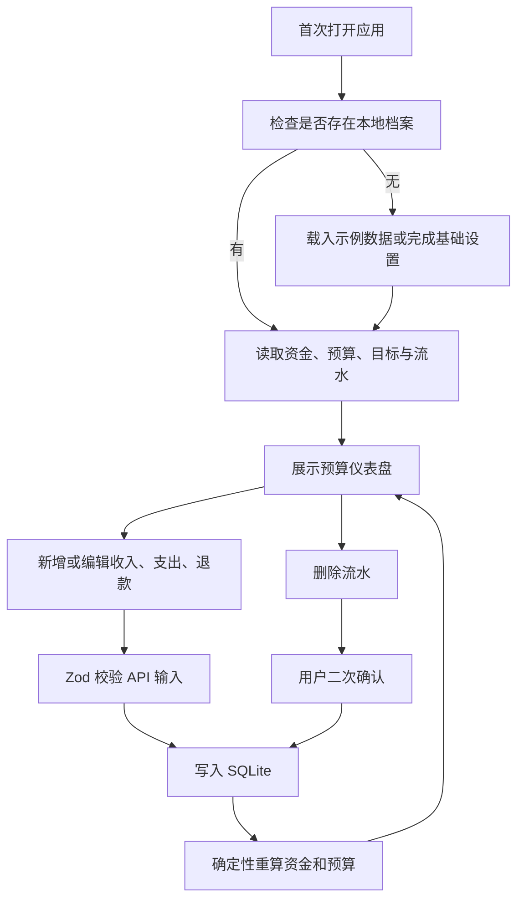

# 大学生消费决策 Agent：第一阶段产品需求

## 1. 产品概述

本阶段交付一个面向单个大学生的本地消费管理 Web 应用，用于长期维护资金背景、预算、储蓄目标、消费偏好和手工消费记录，并通过确定性代码展示总预算与分类预算执行情况。

- 核心价值：先建立可信、可测试的个人财务数据底座，为后续消费建议 Agent 提供结构化上下文。
- 使用方式：用户手工设置资料和预算，手工添加、编辑、查询或删除流水；系统自动重算余额和预算。
- 运行边界：单用户、无登录、本地 SQLite 数据库，不依赖任何第三方账户或外部服务。

## 2. MVP 边界

### 2.1 本阶段包含

1. 维护资金背景：期初可用资金、基准日期、预计月收入、每月固定支出、应急预留金额。
2. 维护储蓄目标：目标名称、目标金额、当前已存金额、目标日期和状态。
3. 设置每月总预算及各消费分类预算。
4. 维护消费偏好：价格倾向、常用消费场景、偏好与避雷项、备注。
5. 手工维护收入、支出、退款三类流水，支持添加、详情、编辑、删除和条件查询。
6. 使用普通 TypeScript 代码计算当前资金、预算已用、剩余、使用率及超支状态。
7. 提供预算仪表盘、示例数据、API 输入验证和自动化测试。

### 2.2 本阶段不包含

- 不接入 LLM，不生成自然语言购买建议，不实现 Agent 自主调用。
- 不提供“吃什么”“买不买”“选哪个”的推荐或判断。
- 不实现 OCR、图片识别、账单导入、自动记账或自动支付。
- 不连接支付宝、微信、银行、外卖、电商或其他第三方平台。
- 不实现多用户、登录、注册、权限或云端同步。
- 不预测未来收支，不自动创建周期流水，不提供投资或信贷建议。

## 3. 核心业务约束

- 所有金额在数据库、API 和业务代码中均为整数分，字段统一使用 `Cents` 后缀。
- 表单允许用户输入元，但提交前必须严格转换为整数分；禁止使用浮点数累计金额。
- 流水金额始终为正整数，资金方向由 `INCOME`、`EXPENSE`、`REFUND` 明确决定。
- 支出消耗预算，退款恢复预算，收入不计入消费预算使用额。
- 删除流水必须经过明确确认；删除后重新计算所有受影响指标。
- 预算结果由纯函数和数据库聚合产生，不调用模型或外部服务。
- 第一阶段只有一个固定本地档案，不在数据模型中提前实现完整认证体系。

## 4. 页面清单

| 页面 | 路由 | 核心功能 |
|---|---|---|
| 预算仪表盘 | `/` | 当前资金、当月总预算、分类预算、近期流水、超支提示、目标进度 |
| 消费记录 | `/transactions` | 分页列表；按类型、分类、日期、关键词查询；进入新增、编辑和详情 |
| 新增记录 | `/transactions/new` | 新增收入、支出或退款；金额元转分；字段联动与校验 |
| 记录详情/编辑 | `/transactions/[id]` | 查看及编辑流水；删除前二次确认；退款关联原支出 |
| 资金与目标 | `/settings/funds` | 编辑资金基线、收入背景、固定支出、应急预留；管理储蓄目标 |
| 预算设置 | `/settings/budgets` | 选择月份；设置总预算和各分类预算；显示分类预算合计差额 |
| 偏好设置 | `/settings/preferences` | 编辑价格敏感度、消费习惯、偏好项、避雷项和备注 |

## 5. 核心流程

## 6. 界面方向

- 桌面优先并适配手机，采用清晰、克制的个人财务工作台风格。
- 仪表盘突出“剩余金额”而不是装饰性图表，颜色同时搭配文字和图标表达状态。
- 正常、接近上限、超支分别使用稳定的语义色；不能只依赖颜色区分。
- 金额统一显示人民币符号、千位分隔和两位小数，负向影响由文案和方向标识表达。
- 表单明确标注单位为“元”；删除使用危险操作对话框，默认焦点不放在确认删除上。
- 空状态提供直接操作入口；加载、校验失败、数据库失败均提供可理解反馈。

## 7. 验收标准

- 用户可以保存并重新读取资金背景、预算、目标和偏好。
- 用户可以完整执行流水新增、查询、编辑和确认删除。
- 收入、支出、退款在存储、展示和计算中不会混淆。
- 任意预算汇总均只对整数分做加减；显示层稳定格式化为两位小数。
- 仪表盘结果与同周期流水数据一致，退款不会使分类净支出低于零。
- 无效金额、日期、类型、分类和退款关联会被 API 拒绝并返回字段级错误。
- 示例数据可通过种子命令重复初始化，并覆盖主要分类与三种流水类型。
- 金额转换、预算纯函数、校验规则和关键 API 具备 Vitest 自动化测试。

## 8. 第一阶段之后的演进接口

后续阶段可以只读复用本阶段的资金、预算、偏好、目标和流水聚合结果，构建消费建议上下文；第一阶段不预留模型密钥、不添加模型 SDK，也不在页面中展示尚不可用的 Agent 操作。
