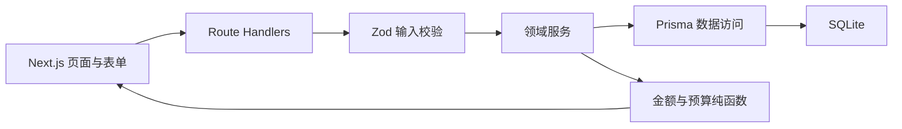
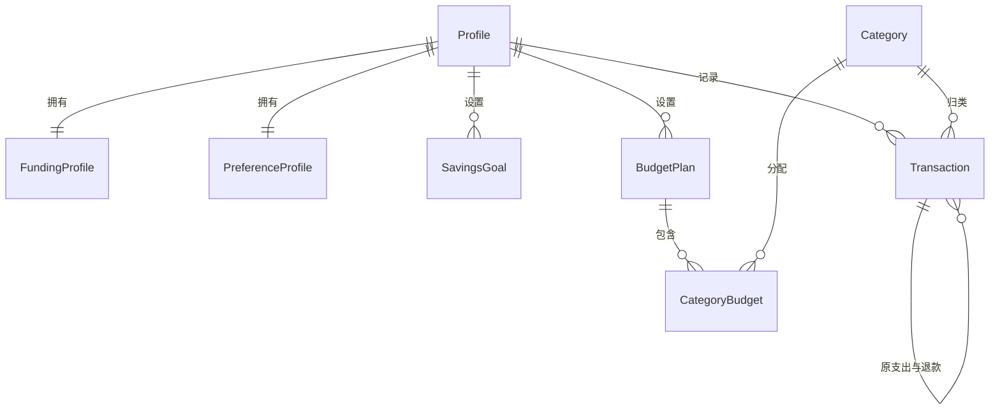

# 大学生消费决策 Agent：第一阶段技术方案

## 1. 技术选型

- 应用框架：Next.js（App Router）+ TypeScript。
- 页面样式：Tailwind CSS，优先使用服务端组件，交互表单与确认对话框使用客户端组件。
- 数据访问：Prisma + SQLite。
- 输入验证：Zod，服务端为最终可信边界，客户端复用适用的 schema 改善反馈。
- 自动化测试：Vitest，覆盖金额工具、预算服务、校验 schema 和 Route Handler。
- 部署目标：第一阶段以本地运行为主，不引入外部数据库、对象存储、认证或密钥。

## 2. 总体架构



Route Handler 负责 HTTP 协议和错误映射，领域服务负责业务规则，Prisma 负责持久化，金额与预算模块保持无框架依赖以便独立测试。

## 3. 数据模型

### 3.1 `Profile`：单用户本地档案

| 字段 | 类型 | 约束/用途 |
|---|---|---|
| `id` | String | 固定单例 ID |
| `displayName` | String? | 可选称呼，不用于登录 |
| `createdAt` / `updatedAt` | DateTime | 审计时间 |

### 3.2 `FundingProfile`：资金背景

| 字段 | 类型 | 约束/用途 |
|---|---|---|
| `profileId` | String | 唯一外键 |
| `openingBalanceCents` | Int | 基准时点实际可用资金，可为 0，不可为负 |
| `balanceAsOf` | DateTime | 资金基准时间 |
| `expectedMonthlyIncomeCents` | Int | 背景信息，不自动生成收入流水 |
| `fixedMonthlyExpenseCents` | Int | 背景信息，不自动消耗分类预算 |
| `emergencyReserveCents` | Int | 不建议用于日常消费的资金 |
| `createdAt` / `updatedAt` | DateTime | 审计时间 |

资金基线仅与 `balanceAsOf` 之后的实际流水共同计算当前资金；预计月收入和固定支出只作为背景展示，避免与手工流水重复记账。

### 3.3 `SavingsGoal`：储蓄目标

| 字段 | 类型 | 约束/用途 |
|---|---|---|
| `id` / `profileId` | String | 主键与所属档案 |
| `name` | String | 1–50 字符 |
| `targetAmountCents` | Int | 正整数 |
| `savedAmountCents` | Int | 非负整数 |
| `targetDate` | DateTime? | 可选目标日期 |
| `status` | String | `ACTIVE`、`COMPLETED`、`PAUSED` |
| `createdAt` / `updatedAt` | DateTime | 审计时间 |

### 3.4 `Category`：消费分类

| 字段 | 类型 | 约束/用途 |
|---|---|---|
| `id` | String | 稳定主键 |
| `code` | String | 唯一代码 |
| `name` | String | 展示名称 |
| `sortOrder` | Int | 展示顺序 |
| `isActive` | Boolean | 停用后保留历史关联 |

示例分类为餐饮、零食饮料、日用品、游戏娱乐、充值、交通、学习和其他。第一阶段不提供分类管理页面，以稳定预算统计口径。

### 3.5 `BudgetPlan` 与 `CategoryBudget`：月度预算

| 模型 | 关键字段 | 约束/用途 |
|---|---|---|
| `BudgetPlan` | `id`, `profileId`, `period`, `totalBudgetCents` | `period` 使用 `YYYY-MM`；每档案每月唯一 |
| `CategoryBudget` | `id`, `budgetPlanId`, `categoryId`, `amountCents` | 每计划每分类唯一；金额为非负整数 |

### 3.6 `PreferenceProfile`：消费偏好

| 字段 | 类型 | 约束/用途 |
|---|---|---|
| `profileId` | String | 唯一外键 |
| `priceSensitivity` | String | `LOW`、`MEDIUM`、`HIGH` |
| `prioritizeNeeds` | Boolean | 是否倾向优先必需消费 |
| `preferredItems` | String? | 偏好项文本，限制长度 |
| `avoidedItems` | String? | 避雷项文本，限制长度 |
| `commonScenarios` | String? | 常用消费场景文本，限制长度 |
| `notes` | String? | 其他说明，限制长度 |
| `createdAt` / `updatedAt` | DateTime | 审计时间 |

### 3.7 `Transaction`：实际流水

| 字段 | 类型 | 约束/用途 |
|---|---|---|
| `id` / `profileId` | String | 主键与所属档案 |
| `type` | String | `INCOME`、`EXPENSE`、`REFUND` |
| `amountCents` | Int | 始终为正整数 |
| `categoryId` | String? | 支出必填；收入为空；退款继承原支出分类 |
| `occurredAt` | DateTime | 实际发生时间 |
| `itemName` | String | 1–100 字符 |
| `merchant` | String? | 可选商家 |
| `note` | String? | 可选备注 |
| `originalTransactionId` | String? | 退款必须关联一笔支出 |
| `createdAt` / `updatedAt` | DateTime | 审计时间 |

退款总额不得超过原支出金额；禁止退款关联收入、退款自身或形成循环。原支出已有退款时，删除或改变其类型应被拒绝，除非先处理关联退款。

### 3.8 关系图



## 4. API 清单

所有写 API 使用 Zod 校验，成功统一返回 `{ data }`，失败统一返回 `{ error: { code, message, fields? } }`。金额只接收整数分，不接受 API 传入的元或小数。

| 方法 | 路径 | 用途 |
|---|---|---|
| `GET` | `/api/profile` | 获取单例档案及基础设置摘要 |
| `PUT` | `/api/profile/funding` | 创建或更新资金背景 |
| `GET` | `/api/profile/preferences` | 获取偏好 |
| `PUT` | `/api/profile/preferences` | 创建或更新偏好 |
| `GET` | `/api/goals` | 查询目标 |
| `POST` | `/api/goals` | 新增目标 |
| `PATCH` | `/api/goals/[id]` | 编辑目标或状态 |
| `DELETE` | `/api/goals/[id]` | 删除目标 |
| `GET` | `/api/categories` | 获取可用消费分类 |
| `GET` | `/api/budgets?period=YYYY-MM` | 获取指定月预算及执行结果 |
| `PUT` | `/api/budgets/[period]` | 整体保存某月总预算和分类预算 |
| `GET` | `/api/transactions` | 按页、类型、分类、日期范围和关键词查询 |
| `POST` | `/api/transactions` | 新增流水 |
| `GET` | `/api/transactions/[id]` | 获取流水详情 |
| `PATCH` | `/api/transactions/[id]` | 编辑流水 |
| `DELETE` | `/api/transactions/[id]` | 删除流水；前端必须先确认 |
| `GET` | `/api/dashboard?period=YYYY-MM` | 获取仪表盘聚合结果和近期流水 |

种子数据通过 `prisma db seed` 执行，不开放可被页面误触发的生产 API。

## 5. 预算计算规则

### 5.1 周期

- 第一阶段采用自然月，周期为本地时区当月第一天 `00:00:00` 至下月第一天之前。
- API 使用 `YYYY-MM` 指定周期；未指定时使用服务器配置的本地当前月份。
- 数据库存储时间使用 UTC，周期边界按 `Asia/Shanghai` 解释后转换为 UTC 查询。

### 5.2 金额方向

```text
signedAmount(INCOME) = +amountCents
signedAmount(EXPENSE) = -amountCents
signedAmount(REFUND) = +amountCents
```

### 5.3 当前资金

```text
账面当前资金 = 期初可用资金
             + 基准时间之后的收入合计
             - 基准时间之后的支出合计
             + 基准时间之后的退款合计

可自由使用资金 = max(账面当前资金 - 应急预留金额, 0)
```

预计月收入、固定月支出和目标已存金额不参与账面当前资金加减，避免和实际流水重复计算。

### 5.4 总预算

```text
月度净支出 = max(月内支出合计 - 月内有效退款合计, 0)
总预算剩余 = 总预算 - 月度净支出
总预算使用率 = 总预算为 0 时返回 null，否则按展示需要计算百分比
```

百分比不用于金额累计；建议以整数基点或“分子/分母”传输，展示层再格式化。

### 5.5 分类预算

```text
分类净支出 = max(该分类支出合计 - 该分类退款合计, 0)
分类预算剩余 = 分类预算 - 分类净支出
分类预算使用率 = 分类预算为 0 时返回 null，否则按展示需要计算百分比
```

- 退款继承原支出的分类，不能任意指定其他分类。
- 未设置分类预算的支出仍计入总预算，并在仪表盘标为“未分配预算”。
- 分类预算合计建议不超过总预算；保存时若超过则拒绝，低于总预算允许并展示“未分配额度”。
- 剩余金额允许为负数以明确表示超支；只有净支出下限截断为 0。

### 5.6 状态

- `NO_BUDGET`：预算为 0 或未设置。
- `NORMAL`：使用率低于 80%。
- `WARNING`：使用率大于等于 80% 且不超过 100%。
- `OVER`：净支出大于预算。

## 6. 输入验证

- 金额：必须为安全整数；支出、收入、退款金额大于 0；配置金额允许 0；设置合理上限防止溢出。
- 日期：必须是有效 ISO 日期；预算周期必须匹配 `YYYY-MM`；目标日期按产品决策校验是否允许过去日期。
- 类型联动：支出必须有分类；收入不得有分类和原流水；退款必须关联原支出且金额不超可退余额。
- 文本：去除首尾空白并限制长度；关键词查询限制长度；不信任客户端传来的档案 ID。
- 查询：分页大小设上限，排序字段使用白名单，日期起点不得晚于终点。
- 更新：只接收白名单字段；不存在返回 404，业务冲突返回 409，校验错误返回 400。

## 7. 建议文件目录

```text
software_AIagent/
├─ prisma/
│  ├─ schema.prisma
│  └─ seed.ts
├─ src/
│  ├─ app/
│  │  ├─ api/
│  │  │  ├─ profile/
│  │  │  ├─ goals/
│  │  │  ├─ categories/
│  │  │  ├─ budgets/
│  │  │  ├─ transactions/
│  │  │  └─ dashboard/
│  │  ├─ transactions/
│  │  │  ├─ new/
│  │  │  └─ [id]/
│  │  ├─ settings/
│  │  │  ├─ funds/
│  │  │  ├─ budgets/
│  │  │  └─ preferences/
│  │  ├─ layout.tsx
│  │  └─ page.tsx
│  ├─ components/
│  │  ├─ dashboard/
│  │  ├─ forms/
│  │  ├─ transactions/
│  │  └─ ui/
│  ├─ lib/
│  │  ├─ db.ts
│  │  ├─ money.ts
│  │  ├─ periods.ts
│  │  └─ api-response.ts
│  ├─ server/
│  │  ├─ repositories/
│  │  └─ services/
│  │     ├─ budget-service.ts
│  │     ├─ funding-service.ts
│  │     └─ transaction-service.ts
│  ├─ schemas/
│  │  ├─ budget.ts
│  │  ├─ funding.ts
│  │  ├─ goal.ts
│  │  ├─ preference.ts
│  │  └─ transaction.ts
│  └─ test/
│     ├─ fixtures/
│     └─ setup.ts
├─ tests/
│  ├─ unit/
│  └─ integration/
├─ .env.example
├─ package.json
└─ vitest.config.ts
```

## 8. 分步骤开发计划

每一步只交付一个可验证的小任务，完成后独立运行格式检查、类型检查和对应测试，不顺带修改无关文件。

1. 初始化 Next.js、TypeScript、Tailwind、ESLint 和 Vitest，验证空项目可运行。
2. 配置 Prisma 与 SQLite，建立第一版 schema 和迁移。
3. 实现金额元/分转换、人民币格式化和安全整数测试。
4. 实现自然月周期与预算纯函数，并覆盖收入、支出、退款、零预算和超支测试。
5. 编写可重复执行的种子数据，包含基础档案、分类、预算、目标和三种流水。
6. 实现资金背景 API、Zod 校验和测试，再实现资金设置页面。
7. 实现储蓄目标 CRUD API 和测试，再接入资金与目标页面。
8. 实现消费偏好 API 和测试，再实现偏好设置页面。
9. 实现月度预算读取/保存 API 和测试，再实现预算设置页面。
10. 实现流水新增与查询 API、校验和测试，再实现列表及新增页面。
11. 实现流水详情、编辑、退款约束和测试，再实现详情编辑页面。
12. 实现删除 API、关联约束和测试，再接入二次确认对话框。
13. 实现仪表盘聚合 API 和测试，再完成总预算、分类预算、目标和近期流水视图。
14. 执行完整测试、类型检查、构建和手工验收，记录运行及验证步骤。

## 9. 待确认决策

1. **预算周期**：建议第一阶段固定自然月；是否需要支持“每月发生活费日”作为自定义起始日？
2. **总预算来源**：建议由用户手工设置，不根据月收入、固定支出或余额自动推导；是否认可？
3. **分类范围**：建议先固定八类并允许停用但不提供自定义分类；是否需要第一阶段支持分类增删改？
4. **退款规则**：建议退款必须关联原支出，且累计退款不能超过原金额；是否认可？
5. **资金基线**：建议预计收入和固定支出仅作为背景，只有实际流水改变账面资金；是否认可？
6. **目标进度**：建议目标的“已存金额”由用户手工维护，不从余额自动推导；是否认可？
7. **示例数据**：建议首次通过明确的种子命令导入，不在每次启动时自动覆盖；是否认可？
8. **运行形态**：当前目录无现有技术栈，建议按上述技术栈建立纯本地单用户应用；是否确认？
